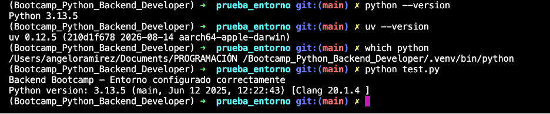

# Mi Ecosistema Backend
Nombre: Angelo Ramírez Zúñiga
Fecha: 16 de Agosto 2026

## 1. El stack del bootcamp

### Python
Python es un lenguaje de alto nivel que se utiliza para desarrollar programas en el backend. Se usa en el backend para crear la lógica del lado del servidor que incluye tareas como gestionar bases de datos, implementar APIs, manejar autenticación y autorización y asegurar una comunicación entre el frontend y el backend.

### FastAPI
[2-3 oraciones: qué hace y por qué se eligió sobre Django o Flask]
Es un framework de Python y está diseñado para construir APIs REST con alto rendimiento y una buena experiencia de desarrollo. 

¿Por qué se eligió FastAPI sobre otros frameworks?
Se eligió debido a las siguientes características:
- Documentación automática
- Validación automática con Pydantic
- Asyn nativo
- Type hints integrados

### PostgreSQL
[2-3 oraciones: qué rol cumple]
- Es el estándar de la industria para APIs modernas
- Soporta JSON nativo (flexibilidad cuando lo necesitas)
- Hosting gratuito disponible (Supabase, Neon)

### Redis
[2-3 oraciones: para qué sirve, con un caso de uso concreto]
Redis (Remote Dictionary Server) es un data store in-memory, lo que significa que guarda datos en la memoria RAM en lugar del disco duro. Esto hace que sea mucho más rápido en responder. Un caso de uso en concreto sería limitar la velocidad de las solicitudes web controlando cuántas veces un usuario puede acceder a tu servidor para evitar abusos como el envío masivo de intentos de inicio de sesión, por ejemplo, permitiendo un máximo de 5 solicitudes por minuto.

### Docker
[2-3 oraciones: qué problema resuelve]
- Peso más ligero: Incluyen sólo los procesos del SO y las dependencias necesarias para ejecutar el código.
- Mejora de la productividad: Las aplicaciones en contenedores se pueden escribir una vez y ejecutarse en cualquier lugar.
- Mayor eficiencia: Los desarrolladores pueden ejecutar varias veces más copias de una aplicación en el mismo hardware que con VM.

## 2. Diagrama del ciclo request/response

Escenario: un usuario busca sus tareas pendientes.

[Tu diagrama. Puede ser ASCII, o una foto de un dibujo a mano,
o hecho en Excalidraw/draw.io y pegado como imagen o link.
Debe incluir: Cliente, DNS, Servidor y Base de Datos,
con las flechas de ida (request) y de vuelta (response).]

### Explicación paso a paso
1. En este caso el proceso comienza desde que el usuario ingresa a una web app para verificar sus tareas pendientes
2. El browser o cliente hace una petición GET - search query "tareas en progreso" o pendientes al DNS que sería la IP del servidor. Esta IP puede ser Asana, Monday, etc.
3. Habiendo pasado por el protocolo TCP se hace una conexión HTTPS a través del puerto 443 al servidor backend.
4. El servidor backend recibe el request y extrae la query que estamos buscando de tareas pendientes
5. Acude a la base de datos en PostgreSQL para hacer la selección de acuerdo a nuestro parámetro de búsqueda
6. Ponemos los resultados que nos queremos que nos muestre esa búsqueda
7. El servidor backend formatea esa respuesta en JSON a través de un estado 200 
8. Obtenemos esa response OK y se muestra la información en pantalla a través del Browser donde se muestran las tareas que tenemos pendientes.

## 3. Tres cosas que aprendí del caso de Instagram

1. **[Load Balancing]** — [Distribuir tráfico entre servidores]. Se cubre en la **Week [19-20]**.
2. **[Database Sharding]** — [Dividir datos entre múltiples bases de datos]. Se cubre en la **Week [19-20]**.
3. **[Monolito-Servicios]** — [Evolución de la arquitectura]. Se cubre en la **Week [19-20]**.

## Mi entorno funcionando

